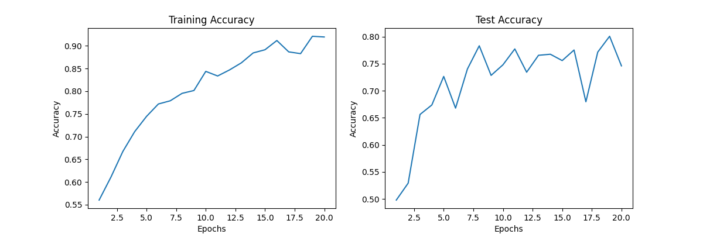

# Model card for "Cat-Dog CNN Classifier"

## Model Description

**Input:** JPG image of a cat or dog

**Output:** Probability of the image being a cat or dog

**Model Architecture:** The image classifier model consists of five convolutional layers with max pooling and activation layers in between. The output of the last convolutional layer is fed into a fully connected layer with a ReLU activation function. The model is trained using the Adam optimizer and the categorical cross-entropy loss function.

## Performance

The model was trained a subset of 1280 cat and dog images from the Kaggle Cats and Dogs Dataset provided by Microsoft Research. It achieves an accuracy of 0.80 on the test set after 19 epochs of training.

## Limitations

Due to the small size of the training set, the model is prone to overfitting. The model is also limited to classifying images of cats and dogs.

## Trade-offs

The model is relatively simple and easy to train, but it would need to be trained on a large dataset to improve accuracy. It is also limited to classifying images of cats and dogs.
